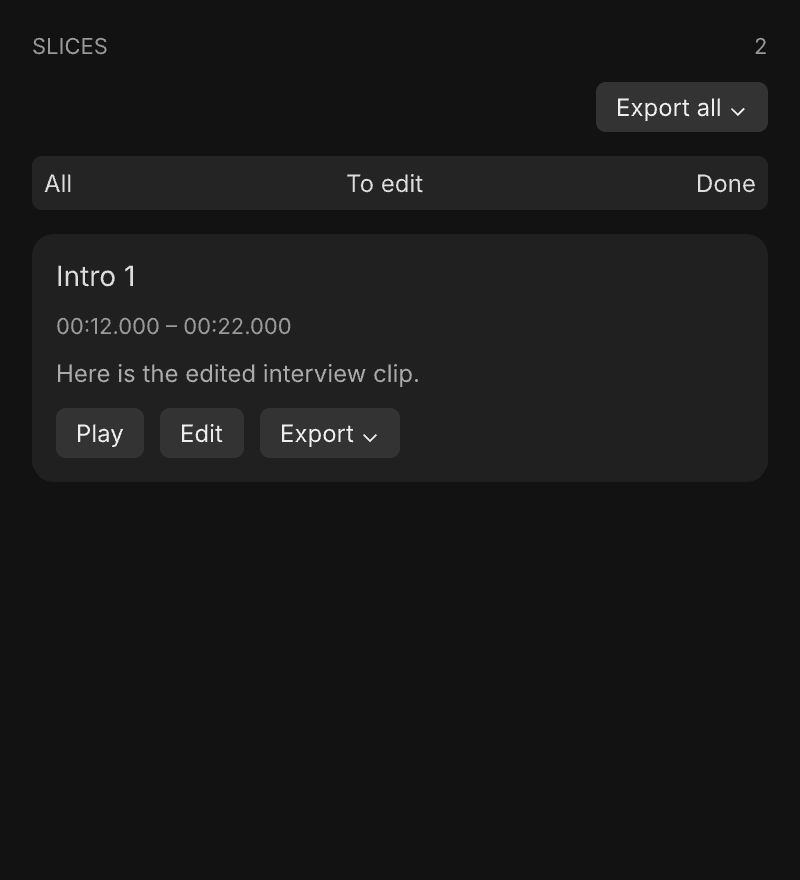
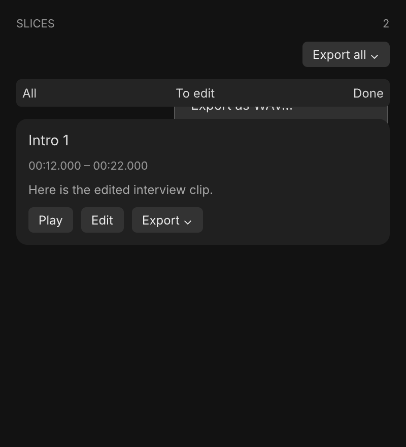
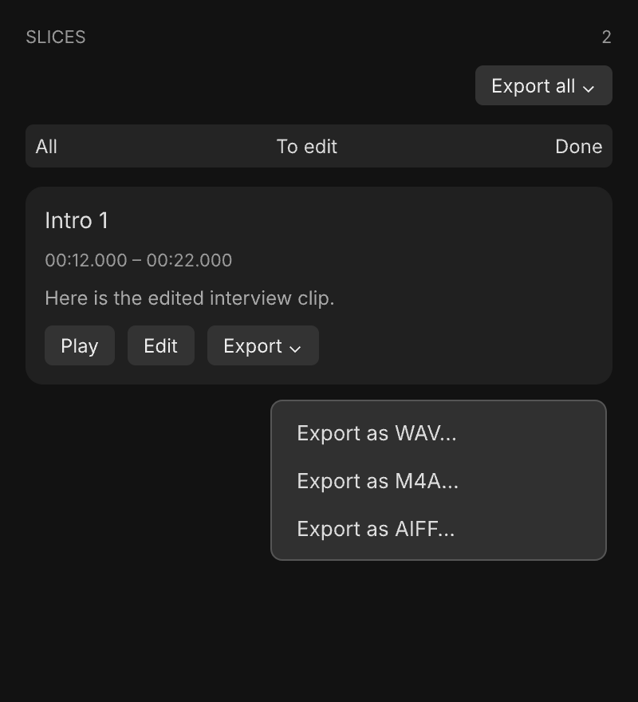
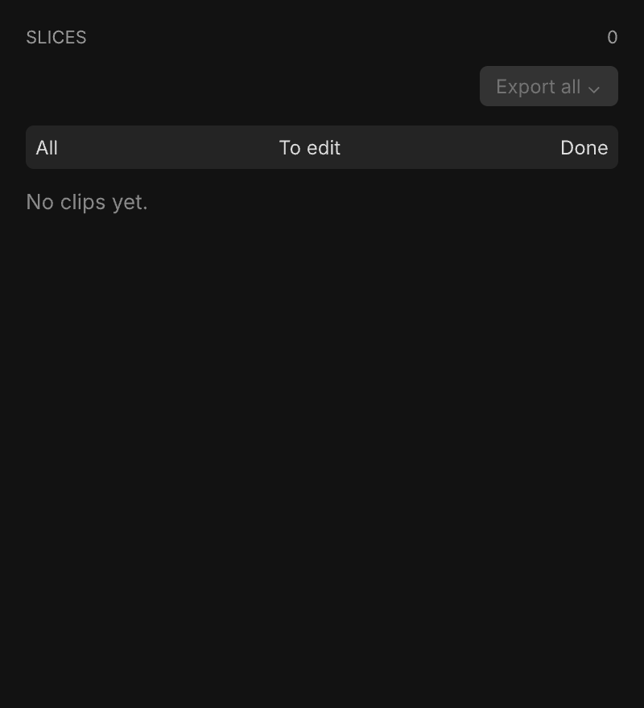

# Export formats — Screens

Pen canvas: `interview-editor.pen` (existing user-owned, untracked canvas; original frames unchanged, four new frames in a separate area). PNG exports below are the durable design deliverable.

## Navigation map
| Screen | Surface | Address | Reached from |
|---|---|---|---|
| Editor export controls | native macOS | n/a (native), existing clips sidebar | Open an interview → Clips or Both tab |

## Editor export controls
- **Status:** Changed
- **Surface:** native macOS
- **Address:** n/a (native); menus attached to the existing sidebar buttons
- **Access:** any open interview with exportable clips
- **Navigated to from:** Editor → Export all; individual clip card → Export
- **Navigates to:** chosen format → existing destination folder picker if needed → export progress / existing filename collision review → Finder; menu dismissal leaves editor unchanged
- **Changed from today:** existing buttons become native menus. The surrounding editor and workflow remain. PNGs show the affected sidebar region; exact menu appearance follows the system SwiftUI Menu. No new modal screen. Existing destination picker copy becomes format-neutral.

| State | When it shows | Node | Mockup |
|---|---|---|---|
| Default | Exportable clips available | Lh1Ge |  |
| All menu | Export all clicked | OJJhm |  |
| Clip menu | A clip Export clicked | UiBrw |  |
| Disabled | No exportable clips; same controls disabled while busy or edits invalid | KG5Fq |  |

Loading/progress, copy errors, cancellation, completion and filename-review screens retain their existing presentation. No new authentication or forbidden state.
